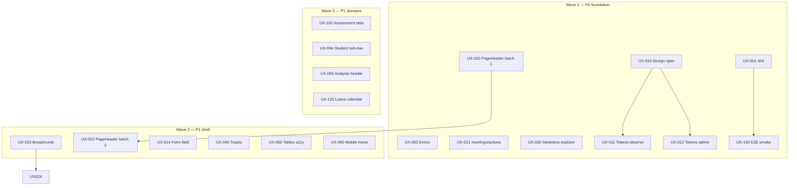

# UX/UI production implementation plan

Tracked plan from the full-app UX/UI audit (May 2026). Use this doc with GitHub Issues/Projects: each **Issue ID** maps 1:1 to a ticket.

**How to track**

| Method | Action |
|--------|--------|
| GitHub Issues | Create one issue per ID below; paste **Acceptance criteria** into the body |
| Project board | Columns: Backlog → P0 → P1 → P2 → Done |
| PR linking | Reference `UX-###` in PR titles/descriptions |
| Doc checkboxes | Check off in PRs when an issue ships |

**Legend:** P0 = launch blocker · P1 = launch quality · P2 = polish · S/M/L = effort

---

## Progress summary

| Epic | Issues | P0 | P1 | P2 | Done |
|------|--------|----|----|-----|------|
| A — Platform shell | 6 | 3 | 2 | 1 | 5/6 |
| B — Design system | 5 | 2 | 2 | 1 | 1/5 |
| C — Page chrome & nav | 7 | 2 | 4 | 1 | 2/7 |
| D — Loading & errors | 4 | 2 | 2 | 0 | 2/4 |
| E — Forms & feedback | 4 | 0 | 3 | 1 | 0/4 |
| F — Accessibility | 4 | 0 | 3 | 1 | 0/4 |
| G — Mobile & tables | 4 | 0 | 3 | 1 | 0/4 |
| H — Home & operations | 5 | 0 | 4 | 1 | 0/5 |
| I — Observations | 4 | 1 | 2 | 1 | 0/4 |
| J — Explorer & analysis | 5 | 0 | 4 | 1 | 0/5 |
| K — Assessments | 4 | 0 | 3 | 1 | 0/4 |
| L — Students & on-call | 4 | 0 | 3 | 1 | 0/4 |
| M — Leave | 3 | 0 | 3 | 0 | 0/3 |
| N — Admin & god | 5 | 0 | 4 | 1 | 3/5 |
| O — Auth & public | 3 | 0 | 2 | 1 | 0/3 |
| P — QA & regression | 3 | 1 | 2 | 0 | 1/3 |
| **Total** | **70** | **11** | **44** | **15** | **38/70** |

---

## Epic A — Platform shell

### UX-001 · Global 404 page
- **Priority:** P0 · **Effort:** S
- **Depends on:** —
- **Scope:** `app/not-found.tsx`
- **Acceptance criteria:**
  - [ ] Branded 404 using ledger tokens (logo, `PageHeader`-style title)
  - [ ] Links: Home (or `/login` if unauthenticated), back
  - [ ] Copy explains mistyped URL / missing permission
  - [ ] Works inside and outside `(tenant)` layout
- **Notes:** Use `getServerSession` or layout split if auth-specific CTAs needed

### UX-002 · Tenant error boundary polish
- **Priority:** P0 · **Effort:** S
- **Depends on:** —
- **Scope:** `app/(tenant)/error.tsx`, optionally `app/error.tsx`
- **Acceptance criteria:**
  - [ ] Uses `Button` component variants (not raw classes)
  - [ ] Shows optional `error.digest` for support (muted meta text)
  - [ ] Retry + Home actions; keyboard accessible
  - [ ] Matches ledger spacing (`max-w-lg`, consistent typography)

### UX-003 · Root error boundary
- **Priority:** P1 · **Effort:** S
- **Depends on:** UX-002
- **Scope:** `app/error.tsx`
- **Acceptance criteria:**
  - [ ] Same visual language as tenant error page
  - [ ] Safe when session provider fails

### UX-004 · Skip to main content
- **Priority:** P1 · **Effort:** S
- **Depends on:** —
- **Scope:** `components/tenant-layout-client.tsx`, `app/login/layout.tsx`
- **Acceptance criteria:**
  - [ ] Visually hidden until focus; jumps to `#tenant-content main` or equivalent
  - [ ] First focusable element in tab order on tenant pages
  - [ ] Login shell has skip to form

### UX-005 · Toast a11y hardening
- **Priority:** P1 · **Effort:** S
- **Depends on:** —
- **Scope:** `components/toast-provider.tsx`
- **Acceptance criteria:**
  - [ ] Toast region has `role="status"` / `aria-live="polite"`
  - [ ] Dismiss button with accessible name
  - [ ] Errors use `aria-live="assertive"` (or separate region)
  - [ ] Toasts don’t trap focus

### UX-006 · Dark mode decision
- **Priority:** P2 · **Effort:** M
- **Depends on:** UX-010 (token pass)
- **Scope:** `app/globals.css`, scattered `dark:` classes
- **Acceptance criteria:**
  - [ ] **Option A:** Remove unused `dark:` utilities and document light-only v1
  - [ ] **Option B:** Ship theme toggle + complete token dark pairs
  - [ ] Decision recorded in `design/anaxi_academic/DESIGN.md`

---

## Epic B — Design system alignment

### UX-010 · Reconcile DESIGN.md with implementation
- **Priority:** P0 · **Effort:** M
- **Depends on:** —
- **Scope:** `design/anaxi_academic/DESIGN.md`, `app/globals.css`, `tailwind.config.ts`
- **Acceptance criteria:**
  - [ ] Document canonical display font (Space Grotesk vs Newsreader)
  - [ ] Document border policy (ghost borders vs none)
  - [ ] Document radius scale (4px app-wide vs xl cards)
  - [ ] No contradictory rules left unmarked as “aspirational”

### UX-011 · Semantic token pass — observation flow
- **Priority:** P0 · **Effort:** L
- **Depends on:** UX-010
- **Scope:** `app/(tenant)/observe/components/*`, `observe/history/*`
- **Acceptance criteria:**
  - [ ] Replace `#111827`, `#9CA3AF`, `#E5E7EB`, etc. with CSS variables
  - [ ] Signal tiles use `Button` / shared chip patterns
  - [ ] Review list textarea matches `.field` styles from globals

### UX-012 · Semantic token pass — admin heavy screens
- **Priority:** P0 · **Effort:** L
- **Depends on:** UX-010
- **Scope:** `admin/taxonomies/*`, `admin/departments/*`, `admin/coaching/*`, `InstitutionalDashboard.tsx`
- **Acceptance criteria:**
  - [ ] Icon well colors use semantic tints or shared `adminIconWell()` map in one file
  - [ ] No new raw hex in touched files
  - [ ] Modals use `Button` not `bg-neutral-950` one-offs

### UX-013 · Stat card canonical style
- **Priority:** P1 · **Effort:** M
- **Depends on:** UX-010
- **Scope:** `components/ui/stat-card.tsx`, Explorer/home KPI usage
- **Acceptance criteria:**
  - [ ] New/updated stat tiles default to `tone="softGrey"`, `accentPlacement="none"`
  - [ ] Document in DESIGN.md when accent bars are allowed
  - [ ] Explorer hub cards audited for no-line rule

### UX-014 · Shared form field primitive
- **Priority:** P1 · **Effort:** M
- **Depends on:** —
- **Scope:** New `components/ui/form-field.tsx` (or extend existing)
- **Acceptance criteria:**
  - [ ] Label + control + hint + inline error slot
  - [ ] Uses `.field` / ghost border from globals
  - [ ] Adopted on leave request + one admin modal as reference

---

## Epic C — Page chrome & navigation

### UX-020 · PageHeader migration — batch 1 (orphan H1 pages)
- **Priority:** P0 · **Effort:** M
- **Depends on:** —
- **Scope:** `meetings/actions`, `god/*`, `behaviour/import/job/[id]`, `admin/email-log`, `students/import-subject-teachers`, `onboarding/wizard-client`
- **Acceptance criteria:**
  - [ ] Every page uses `PageHeader variant="ledger"` or documented exception
  - [ ] Eyebrow shows section path where applicable
  - [ ] No duplicate bare `H1` for page title

### UX-021 · Remove or redirect `/meetings/actions`
- **Priority:** P0 · **Effort:** S
- **Depends on:** —
- **Scope:** `app/(tenant)/meetings/actions/page.tsx`, nav links
- **Acceptance criteria:**
  - [ ] `redirect('/my-actions')` or delete route
  - [ ] No internal links point to `/meetings/actions`
  - [ ] Optional: add note in changelog

### UX-022 · PageHeader migration — batch 2 (custom headers)
- **Priority:** P1 · **Effort:** M
- **Depends on:** UX-020
- **Scope:** `leave/request`, `leave/[id]`, `leave/calendar`, `meetings/new`, `meetings/[id]`, `on-call/new`, `on-call/[id]`
- **Acceptance criteria:**
  - [ ] Replace hand-rolled `anx-page-header-shell` blocks with `PageHeader`
  - [ ] Actions slot used for primary CTAs

### UX-023 · Breadcrumb component (generic)
- **Priority:** P1 · **Effort:** M
- **Depends on:** UX-020
- **Scope:** New `components/ui/breadcrumb.tsx`; refactor `components/assessments/assessments-chrome.tsx`
- **Acceptance criteria:**
  - [ ] `Breadcrumb` items: `{ label, href? }[]`
  - [ ] Assessments breadcrumb uses shared component (no regression)
  - [ ] Keyboard navigable; current page `aria-current="page"`

### UX-024 · Breadcrumbs — Explorer & analysis
- **Priority:** P1 · **Effort:** M
- **Depends on:** UX-023
- **Scope:** `explorer/*`, `analysis/*`, `instruction/teachers`
- **Acceptance criteria:**
  - [ ] Sub-routes show Explorer → {section} → {detail}
  - [ ] Analysis teacher/student pages link back to source list

### UX-025 · Breadcrumbs — Admin
- **Priority:** P1 · **Effort:** S
- **Depends on:** UX-023
- **Scope:** All `admin/*` pages with `PageHeader`
- **Acceptance criteria:**
  - [ ] Eyebrow pattern: `Administration › {area}` consistent
  - [ ] Dashboard links back from every admin page header

### UX-026 · Admin nav discoverability
- **Priority:** P2 · **Effort:** M
- **Depends on:** UX-025
- **Scope:** `components/tenant-nav.tsx`, `admin/InstitutionalDashboard.tsx`
- **Acceptance criteria:**
  - [ ] Either expand sidebar Administration items **or** dashboard search/filter for all admin routes
  - [ ] Coaching, timetable, taxonomies, language, signals, imports reachable in ≤2 clicks from `/admin`

---

## Epic D — Loading & skeleton coverage

### UX-030 · Loading skeletons — Explorer & instruction
- **Priority:** P0 · **Effort:** M
- **Depends on:** —
- **Scope:** Add `loading.tsx` under `explorer/teachers`, `explorer/students`, `explorer/signals`, `instruction/teachers`, etc.
- **Acceptance criteria:**
  - [ ] Each uses appropriate `TenantRouteSkeleton` variant (`table` / `analytics`)
  - [ ] `aria-busy` preserved

### UX-031 · Loading skeletons — Leave & meetings detail
- **Priority:** P1 · **Effort:** S
- **Depends on:** —
- **Scope:** `leave/request`, `leave/[id]`, `leave/calendar`, `meetings/new`
- **Acceptance criteria:**
  - [ ] Form/detail variants match final layout
  - [ ] No layout shift > 1 row on hydrate

### UX-032 · Loading skeletons — Admin & god
- **Priority:** P1 · **Effort:** M
- **Depends on:** —
- **Scope:** `admin/users`, `admin/taxonomies`, `admin/settings`, `god/*`, `analysis/*`
- **Acceptance criteria:**
  - [ ] Admin variant for settings; table variant for directories
  - [ ] God pages covered

### UX-033 · Student detail loading
- **Priority:** P1 · **Effort:** S
- **Depends on:** —
- **Scope:** `students/[id]/loading.tsx`
- **Acceptance criteria:**
  - [ ] `TenantRouteSkeleton variant="detail"` with header + tab placeholders

---

## Epic E — Forms & feedback

### UX-040 · Standardize mutation feedback
- **Priority:** P1 · **Effort:** M
- **Depends on:** UX-005
- **Scope:** Server actions across meetings, leave, on-call, admin users
- **Acceptance criteria:**
  - [ ] Success → toast (or redirect + flash toast pattern)
  - [ ] Validation errors → inline field errors
  - [ ] Document pattern in `AGENTS.md` or component README

### UX-041 · Observation wizard feedback
- **Priority:** P1 · **Effort:** S
- **Depends on:** UX-040, UX-011
- **Scope:** `ObservationWizard.tsx`, submit flows
- **Acceptance criteria:**
  - [ ] Replace inline-only toast text with `toast()` for submit/draft
  - [ ] Draft saved indicator visible in wizard chrome

### UX-042 · Double-submit prevention audit
- **Priority:** P1 · **Effort:** S
- **Depends on:** —
- **Scope:** All forms with `type="submit"`
- **Acceptance criteria:**
  - [ ] Primary buttons disable while pending
  - [ ] Checklist of audited routes attached to PR

### UX-043 · Leave request form field migration
- **Priority:** P2 · **Effort:** S
- **Depends on:** UX-014, UX-022
- **Scope:** `leave/request/page.tsx`
- **Acceptance criteria:**
  - [ ] Uses shared form field primitive
  - [ ] Policy hints adjacent to date fields

---

## Epic F — Accessibility

### UX-050 · Data table accessibility pass
- **Priority:** P1 · **Effort:** L
- **Depends on:** —
- **Scope:** `UserDirectoryTable`, Explorer tables, assessments tables, leave tables
- **Acceptance criteria:**
  - [ ] `<table>` with `<thead>`, scope on headers
  - [ ] Sortable columns announce state
  - [ ] Row actions reachable by keyboard

### UX-051 · Horizontal scroll affordances
- **Priority:** P1 · **Effort:** M
- **Depends on:** —
- **Scope:** Pages with `overflow-x-auto` tables (see audit grep list)
- **Acceptance criteria:**
  - [ ] Visual fade or “Scroll for more” hint on mobile
  - [ ] Optional: sticky first column on 2 highest-traffic tables

### UX-052 · Focus ring consistency
- **Priority:** P1 · **Effort:** S
- **Depends on:** —
- **Scope:** Custom buttons/links bypassing `Button`
- **Acceptance criteria:**
  - [ ] All interactive elements have visible `:focus-visible` ring
  - [ ] Ring uses design tokens not ad hoc `ring-black/10` only

### UX-053 · Color-blind safe status encoding
- **Priority:** P2 · **Effort:** M
- **Depends on:** —
- **Scope:** Risk bands, assessment deltas, heatmaps
- **Acceptance criteria:**
  - [ ] Status pills include text labels (not color-only)
  - [ ] Compare/delta views use icon or pattern in addition to hue

---

## Epic G — Mobile & responsive

### UX-060 · Mobile pass — Home dashboard
- **Priority:** P1 · **Effort:** M
- **Depends on:** —
- **Scope:** `app/(tenant)/home/page.tsx`, home components
- **Acceptance criteria:**
  - [ ] Verified at 375px: no horizontal overflow
  - [ ] Secondary cards collapsible or below fold
  - [ ] Dept switcher usable on touch

### UX-061 · Mobile pass — Explorer students & filters
- **Priority:** P1 · **Effort:** M
- **Depends on:** —
- **Scope:** `StudentsToolbar`, `StudentsListSection`, critical banner
- **Acceptance criteria:**
  - [ ] Filters collapse to sheet or single “Filters” drawer on `<md`
  - [ ] Watchlist toggle has visible text label

### UX-062 · Mobile pass — Assessments point detail
- **Priority:** P1 · **Effort:** L
- **Depends on:** UX-070
- **Scope:** `assessments/.../points/[pointId]/page.tsx`
- **Acceptance criteria:**
  - [ ] Tables scroll with UX-051 hints
  - [ ] Primary actions reachable without scrolling past full table

### UX-063 · Mobile card view for user directory
- **Priority:** P2 · **Effort:** M
- **Depends on:** UX-050
- **Scope:** `UserDirectoryTable.tsx`
- **Acceptance criteria:**
  - [ ] `<md` shows card list with same data
  - [ ] Actions available per card

---

## Epic H — Home & operations

### UX-070 · Home — unify risk/status chips
- **Priority:** P1 · **Effort:** S
- **Depends on:** UX-013
- **Scope:** `home/page.tsx` (e.g. `DualFlaggedRiskBadge`)
- **Acceptance criteria:**
  - [ ] Custom orange border pill replaced with `StatusPill` or risk tokens

### UX-071 · Home — window selector in URL
- **Priority:** P1 · **Effort:** M
- **Depends on:** —
- **Scope:** `home/page.tsx`, home modules
- **Acceptance criteria:**
  - [ ] `window` query param drives data; shareable links
  - [ ] Control in header area; persists across navigation where relevant

### UX-072 · Meetings — detail & new page chrome
- **Priority:** P1 · **Effort:** M
- **Depends on:** UX-022, UX-031
- **Scope:** `meetings/new`, `meetings/[id]`
- **Acceptance criteria:**
  - [ ] PageHeader + breadcrumb from meetings list
  - [ ] Notes editor shows last-saved time in UI

### UX-073 · Meetings — empty states
- **Priority:** P2 · **Effort:** S
- **Depends on:** —
- **Scope:** `meetings/page.tsx`
- **Acceptance criteria:**
  - [ ] Zero meetings → `EmptyState` with CTA to schedule

### UX-074 · My Actions — reference doc
- **Priority:** P2 · **Effort:** S
- **Depends on:** —
- **Scope:** `docs/ux-production-plan.md` or `components/ui/README.md`
- **Acceptance criteria:**
  - [ ] `/my-actions` cited as reference implementation for list + header + stats

---

## Epic I — Observations

### UX-080 · Observation wizard — step chrome
- **Priority:** P1 · **Effort:** M
- **Depends on:** UX-011
- **Scope:** `ProgressHeader`, `ObservationStageLayout`, `ReviewStageChrome`
- **Acceptance criteria:**
  - [ ] Step indicator consistent across new → signals → review
  - [ ] “Draft saved” visible when localStorage draft exists

### UX-081 · Observation history — mobile filters
- **Priority:** P1 · **Effort:** M
- **Depends on:** UX-011
- **Scope:** `observe/history/*`
- **Acceptance criteria:**
  - [ ] `HistoryFilters` usable on `<md`
  - [ ] Export/print grouped in overflow menu on small screens

### UX-082 · Observation detail header
- **Priority:** P2 · **Effort:** S
- **Depends on:** UX-023
- **Scope:** `observe/[id]/page.tsx`
- **Acceptance criteria:**
  - [ ] PageHeader with teacher, date, link to history

### UX-083 · Align observation print/export
- **Priority:** P2 · **Effort:** S
- **Depends on:** —
- **Scope:** `PrintExportButtons.tsx`
- **Acceptance criteria:**
  - [ ] Print stylesheet uses tokens; readable in grayscale

---

## Epic J — Explorer & analysis

### UX-090 · Explorer hub — mobile KPI grid
- **Priority:** P1 · **Effort:** S
- **Depends on:** UX-030
- **Scope:** `explorer/page.tsx`
- **Acceptance criteria:**
  - [ ] Max 2 columns on mobile; no clipped stat labels

### UX-091 · Explorer students — export & empty states
- **Priority:** P1 · **Effort:** M
- **Depends on:** —
- **Scope:** `explorer/students/*`
- **Acceptance criteria:**
  - [ ] Empty filter results → `DataTableEmpty` or `EmptyState`
  - [ ] Export CSV if product expects it (confirm with PM)

### UX-092 · Explorer analysis — filter presets
- **Priority:** P2 · **Effort:** L
- **Depends on:** —
- **Scope:** `explorer/analysis/BehaviourAnalysisFilters.tsx`
- **Acceptance criteria:**
  - [ ] Save named filter preset per user (cookie or DB — specify in issue)

### UX-093 · Analysis teacher profile header
- **Priority:** P1 · **Effort:** M
- **Depends on:** UX-024
- **Scope:** `analysis/teachers/[memberId]/page.tsx`
- **Acceptance criteria:**
  - [ ] PageHeader with avatar, risk pill, breadcrumb
  - [ ] Cross-link to Explorer teacher view

### UX-094 · Student profile sub-nav
- **Priority:** P1 · **Effort:** M
- **Depends on:** UX-024, UX-033
- **Scope:** `students/[id]/page.tsx`
- **Acceptance criteria:**
  - [ ] Sticky/local nav: Overview | Attainment | Snapshots | On-call
  - [ ] Deep links via hash or query `?tab=`

---

## Epic K — Assessments

### UX-100 · Point detail — tabbed layout
- **Priority:** P1 · **Effort:** L
- **Depends on:** UX-023
- **Scope:** `assessments/.../points/[pointId]/page.tsx`
- **Acceptance criteria:**
  - [ ] Tabs: Overview | Upload | EM | (existing sections mapped)
  - [ ] URL reflects tab; no loss of deep links

### UX-101 · Upload flow UX
- **Priority:** P1 · **Effort:** M
- **Depends on:** —
- **Scope:** `points/[pointId]/upload/page.tsx`
- **Acceptance criteria:**
  - [ ] Drag-drop zone, file type hint, validation summary
  - [ ] Error rows downloadable or listed

### UX-102 · Triangulation & setup tooltips
- **Priority:** P2 · **Effort:** S
- **Depends on:** —
- **Scope:** `assessments/triangulation`, `assessments/setup`
- **Acceptance criteria:**
  - [ ] First-visit helper text or collapsible “What is this?”

### UX-103 · Compare view — a11y deltas
- **Priority:** P2 · **Effort:** M
- **Depends on:** UX-053
- **Scope:** `assessments/.../compare/page.tsx`
- **Acceptance criteria:**
  - [ ] Deltas show +/- text labels, not red/green alone

---

## Epic L — Students & on-call

### UX-110 · Students/my — PageHeader
- **Priority:** P1 · **Effort:** S
- **Depends on:** UX-020
- **Scope:** `students/my/page.tsx`
- **Acceptance criteria:**
  - [ ] Ledger header for teacher-facing list

### UX-111 · On-call new — student search a11y
- **Priority:** P1 · **Effort:** M
- **Depends on:** —
- **Scope:** `on-call/new`, `SearchableSelect`
- **Acceptance criteria:**
  - [ ] Combobox pattern: arrow keys, aria-activedescendant, label

### UX-112 · On-call detail timeline
- **Priority:** P2 · **Effort:** M
- **Depends on:** UX-022
- **Scope:** `OnCallDetail.tsx`
- **Acceptance criteria:**
  - [ ] Status change history visible
  - [ ] Mobile action bar for resolve/assign

### UX-113 · Behaviour import job report chrome
- **Priority:** P1 · **Effort:** S
- **Depends on:** UX-020
- **Scope:** `behaviour/import/job/[id]/page.tsx`
- **Acceptance criteria:**
  - [ ] PageHeader; failed row summary; link back to import list

---

## Epic M — Leave

### UX-120 · Leave calendar token pass
- **Priority:** P1 · **Effort:** M
- **Depends on:** UX-012
- **Scope:** `LeaveCalendarGrid.tsx`
- **Acceptance criteria:**
  - [ ] Replace `#E5E7EB`, `#2563EB` with tokens
  - [ ] Mobile: month navigation obvious (larger hit targets)

### UX-121 · Leave detail — approval mobile bar
- **Priority:** P1 · **Effort:** M
- **Depends on:** UX-022
- **Scope:** `leave/[id]/page.tsx`
- **Acceptance criteria:**
  - [ ] Approve/deny sticky on `<md` for approvers
  - [ ] Audit trail section labeled

### UX-122 · Leave history export
- **Priority:** P2 · **Effort:** S
- **Depends on:** —
- **Scope:** `leave/history/*`
- **Acceptance criteria:**
  - [ ] CSV export for HR roles (permission-gated)

---

## Epic N — Admin & god

### UX-130 · Admin dashboard search
- **Priority:** P1 · **Effort:** M
- **Depends on:** —
- **Scope:** `InstitutionalDashboard.tsx`
- **Acceptance criteria:**
  - [ ] Filter admin destination rows by label
  - [ ] Keyboard shortcut `/` focuses search

### UX-131 · Admin email log — PageHeader
- **Priority:** P1 · **Effort:** S
- **Depends on:** UX-020
- **Scope:** `admin/email-log/page.tsx`
- **Acceptance criteria:**
  - [ ] Ledger header; failed emails highlighted

### UX-132 · God mode platform banner
- **Priority:** P1 · **Effort:** S
- **Depends on:** UX-020
- **Scope:** `app/god/layout.tsx`
- **Acceptance criteria:**
  - [ ] Persistent banner: “Platform administration”
  - [ ] Distinct from tenant shell

### UX-133 · God audit pagination
- **Priority:** P2 · **Effort:** M
- **Depends on:** —
- **Scope:** `god/audit/page.tsx`
- **Acceptance criteria:**
  - [ ] Paginated table; default sort documented

### UX-134 · Strategy board — Button alignment
- **Priority:** P2 · **Effort:** S
- **Depends on:** UX-012
- **Scope:** `StrategyBoardClient.tsx`
- **Acceptance criteria:**
  - [ ] Modals and primary actions use `Button` component

---

## Epic O — Auth & public

### UX-140 · Landing footer & meta
- **Priority:** P2 · **Effort:** S
- **Depends on:** —
- **Scope:** `app/page.tsx`, `app/layout.tsx` metadata
- **Acceptance criteria:**
  - [ ] Footer with support/contact placeholder
  - [ ] OpenGraph title/description

### UX-141 · Password reset UX copy
- **Priority:** P1 · **Effort:** S
- **Depends on:** —
- **Scope:** `login/forgot-password`, `login/reset-password`
- **Acceptance criteria:**
  - [ ] “Check spam” on sent state
  - [ ] Password requirements visible on reset form

### UX-142 · Invite token error states
- **Priority:** P1 · **Effort:** S
- **Depends on:** UX-001
- **Scope:** `invite/[token]/page.tsx`
- **Acceptance criteria:**
  - [ ] Invalid/expired token → branded empty state, not generic error

---

## Epic P — QA & regression

### UX-150 · Playwright smoke — authenticated routes
- **Priority:** P0 · **Effort:** L
- **Depends on:** UX-001, UX-021
- **Scope:** `tests/e2e/`
- **Acceptance criteria:**
  - [ ] Smoke loads: `/home`, `/explorer`, `/my-actions`, `/admin` (demo seed)
  - [ ] Asserts `PageHeader` / main landmark visible
  - [ ] CI job unchanged or extended in `.github/workflows/ci.yml`

### UX-151 · Visual regression baseline (optional tool)
- **Priority:** P2 · **Effort:** L
- **Depends on:** UX-150
- **Scope:** Playwright screenshots or Percy/Chromatic
- **Acceptance criteria:**
  - [ ] 5–10 critical pages baselined
  - [ ] Document update process in `docs/ux-production-plan.md`

### UX-152 · Empty state audit checklist
- **Priority:** P1 · **Effort:** M
- **Depends on:** —
- **Scope:** All list `page.tsx` under `(tenant)`
- **Acceptance criteria:**
  - [ ] Spreadsheet or checklist: route → empty component → CTA
  - [ ] Gaps filed as sub-issues or fixed in same PR

---

## Suggested implementation order



| Wave | Focus | Issue IDs |
|------|--------|-----------|
| 1 | Ship blockers | UX-001, 002, 010, 011, 012, 020, 021, 030, 150 |
| 2 | Consistency | UX-004, 005, 013, 014, 022, 023, 031, 032, 040, 042, 050, 051, 060, 061, 070, 071, 072, 090, 093, 094, 110, 111, 113, 120, 121, 130, 131, 132, 141, 142, 152 |
| 3 | Depth & polish | Remaining P2 + UX-100, 103, 112, 122, 133, 134, 140, 151 |

---

## GitHub issue template (copy per ticket)

```markdown
## Summary
<!-- one line from plan -->

## Priority
P0 | P1 | P2

## Epic
<!-- e.g. Epic C — Page chrome -->

## Acceptance criteria
- [ ] ...

## Files / areas
<!-- from plan scope -->

## Depends on
UX-###

## Definition of done
- [ ] `npm run lint` passes
- [ ] `npm test` passes (add tests if behaviour changes)
- [ ] Screenshots for UI changes (mobile + desktop)
- [ ] Checked off in `docs/ux-production-plan.md`
```

---

## Changelog

| Date | Change |
|------|--------|
| 2026-05-19 | Initial plan from full-app UX audit |
| 2026-05-19 | Wave 1 partial: 404, errors, skip link, toast a11y, breadcrumbs, loading skeletons, meetings/actions redirect, observe tokens, god banner, E2E smoke |
| 2026-05-19 | UX plan batch: form-field, admin icon wells, observe/leave tokens, loading routes, student profile nav, explorer KPI tokens, E2E explorer/admin, landing footer/OG, docs |
| 2026-05-19 | Wave 2–3: PageHeader batch 2 (leave calendar), AdminPageChrome, FormField leave request, SubmitButton, leave CSV export, user directory mobile cards, TableScrollRegion, strategy Button, explorer breadcrumbs, triangulation helper, empty-state checklist, visual baseline spec |
